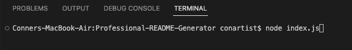
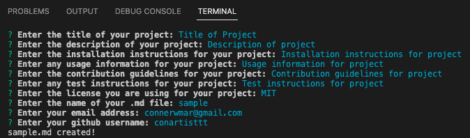
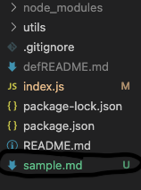

# Professional README Generator

## Description

The purpose of this application is to allow users to generate a high-quality README file for their applications on the command-line. This will enable project creators to devote more time to working on their project.

* **Demonstration of Application:** [Application Walkthrough](insert video link here)

## Features

When the program is run, the user is prompted for information about their repository.
After each prompt is answers, a professional README file is generated with:
- title
- description
- table of contents
- installation instructions
- usage information
- license information
- contrubtion guidelines
- test instructions
- question resources

## Usuage

To use this application, clone it.
Be sure to have NodeJS and NPM.  
You must first download the node packages you need using command ```npm install```  
Then, run the application using command ```node index.js```
Answer the prompts in the terminal and a professional .md file will generate.

* **The following images show a demonstration of my web applications appearance and functionality:**  
<br>
Initiate the Application  
<br>

  
<br>
Answer Prompts in Command Line  
<br>

  
<br>
Professional .md file generated based on input!  
<br>

  
<br>

## Technologies Used

* JavaScript
* Node.js
   * Inquirer 8.2.4 package
   * Email-Validator 2.0.4 package

## Credits

* Starter code provided by edX Boot Camps LLC
* Code updated by Conner Martin